# 基于DDTVWeb API 开发的web UI

## 关于本项目
本项目基于[DDTV](https://ddtv.pro/)的 [WEB API](https://ddtv.pro/API/)开发而成。

> **❓什么是WEB API**
当前DDTV的接口分为两种，**并且只对DDTV_WEB_Server有效，其他版本是不能使用WEB请求和API操作。**
具体有何不同可以参见下表。

|接口类型|请求是否需要携带cookie|请求是否需要携带sig|说明|
|:--:|:--:|:--:|:--:|
|WEB请求|✅|❌|一般用于前端请求，需要先调用login接口进行登录，之后的操作每次携带登录返回的cookie即可|
|API操作|❌|✅|一般用于程序调用，每个请求都可以直接调用，每次操作都需要携带根据key计算的sig|

具体有何区别，请参阅[两种接口的调用差异](https://ddtv.pro/API/)


## 自行构建
如果你想要走在时代前沿，引领时代潮流，可以尝试克隆仓库代码，自行构建。
```
npm install
npm run serve
npm run build
```
更多自行构建的相关信息参见 [这里](https://cli.vuejs.org/config/).

## 配置&使用
### 文件结构
一个完整的项目文件结构应当如下图所示：
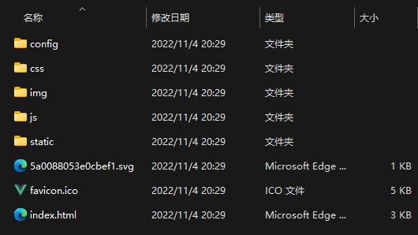
|名称|说明|
|:--:|:--:|
|config |是储存配置文件的地方|
|index  |主页|
|其他|不重要，但是别删，略|

### 修改配置文件
在config文件夹中，有两个配置文件，如下图所示：
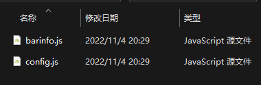

**其中**,通过修改`barinfo.js`的内容，可以实现个性化的页面底部信息展示：


`barinfo.js`的内容如下。

```js
window.BarInfo = {
    // 这里填入自己的备案信息，请务必修改。
    // 盗用他人备案号属违法行为，请如实填写，合规接入。
    // 是否显示
    show: false,
    // 显示的版权信息 show：是否显示 text:文字 link:需要跳转的链接 没有链接填空 "" 没有信息不显示即可
    info: { show: true, text: "Copyright © 2022 NGWORKS", link: "https://space.bilibili.com/254397112" },
    // 显示的TCP备案信息 show：是否显示 text:文字 link:需要跳转的链接 没有链接填空 "" 没有信息不显示即可
    ICP: { show: true, text: "陕ICP备2021012468号-1", link: "https://beian.miit.gov.cn/#/Integrated/index" },
    // 显示的公安备案信息 show：是否显示 text:文字 link:需要跳转的链接 没有链接填空 "" 没有信息不显示即可
    GA: { show: true, text: "陕公网安备 61010402000659号", link: "http://www.beian.gov.cn/portal/registerSystemInfo?recordcode=61010402000659" },
}
```

**其中**,通过修改`config.js`的内容，可以实现更高级的部署操作：
> **⚠注意**：不正确的修改`config.js`可能造成网页无法访问的后果！

`config.js`的内容如下。
```js
window.apiObj = {
  // 如果您是前后端部署在一起，本配置填写 false 即可
  // 如果您是前端后端分离 这里配置你的后端地址
  // 如 http(s)://you.host:port (最后面不需要 / )
  apiUrl: "http://127.0.0.1:11419",
  // 这里是用来配置主要展示的挂载磁盘，仅Linux系统配置有效。
  // 默认展示的是 / 下挂载的磁盘，您可根据自身情况更改
  mount: '/ddtv',
  // 腾讯云服务器云监控插件(私有)，您无需修改。
  monitor:false,
  // cookie 域名 如果您属于跨域部署前后端 必须进行配置
  // 否则将不会清除过期cookie 如果没有，本配置填写 false 即可
  cookieDomain: false
}
```
> 修改上述配置文件后如果不生效，请清除浏览器缓存。
## 实践
### 前置知识
#### 跨域
当一个请求url的**协议、域名、端口**三者之间**任意一个**与当前页面url不同即为跨域。

**为什么会出现跨域**
出于浏览器的同源策略限制。同源策略是一种约定，它是浏览器最核心也最基本的安全功能，如果缺少了同源策略，则浏览器的正常功能可能都会受到影响。可以说Web是构建在同源策略基础之上的，浏览器只是针对同源策略的一种实现。同源策略会阻止一个域的。javascript脚本和另外一个域的内容进行交互。所谓同源（即指在同一个域）就是两个页面具有相同的协议，主机和端口号。

>想要了解更多关于跨域的内容，可以阅读这里

|当前页面url|被请求页面url|是否跨域|原因|
|:--:|:--:|:--:|:--:|
|http://www.ngworks.cn/|http://www.ngworks.cn/index.html|否|同源（协议、域名、端口号相同）|
|http://www.ngworks.cn/|https://www.ngworks.cn/index.html|跨域|协议不同（http/https）|
|http://www.ngworks.cn/|http://www.baidu.com/|跨域|主域名不同（ngworks/baidu）|
|http://www.ngworks.cn/|http://blog.ngworks.cn/|跨域|子域名不同（www/blog）|
|http://www.ngworks.cn:8080/|http://www.ngworks.cn:7001/|跨域|端口号不同（8080/7001）|

> 当您部署网页时出现 “无法与后端建立连接” 错误时，**排除完毕后端和网络问题后**，就**有可能**出现跨域原因。

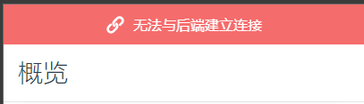

此时进入`开发者工具`会发现有以下错误：
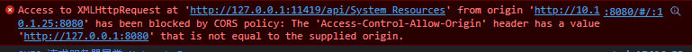

> 错误可能不相同 请注意关键字 **CORS**

### 前后端分离部署页面（NGINX）
### 前后端分离部署页面（腾讯云COS）
> **⚠注意**：腾讯云为每个账号提供了一些免费的云资源额度，超出额度可能**产生费用** [了解详情](https://cloud.tencent.com/document/product/436/6240)腾讯云产品计费规则 [定价](https://cloud.tencent.com/document/product/436/16871) ，请您根据个人需求使用，使用前充分了解规则。

登录腾讯云，进入[对象存储控制台](https://console.cloud.tencent.com/cos)。

进入[储存桶列表](https://console.cloud.tencent.com/cos/bucket)
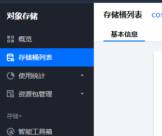

点击**创建存储桶**
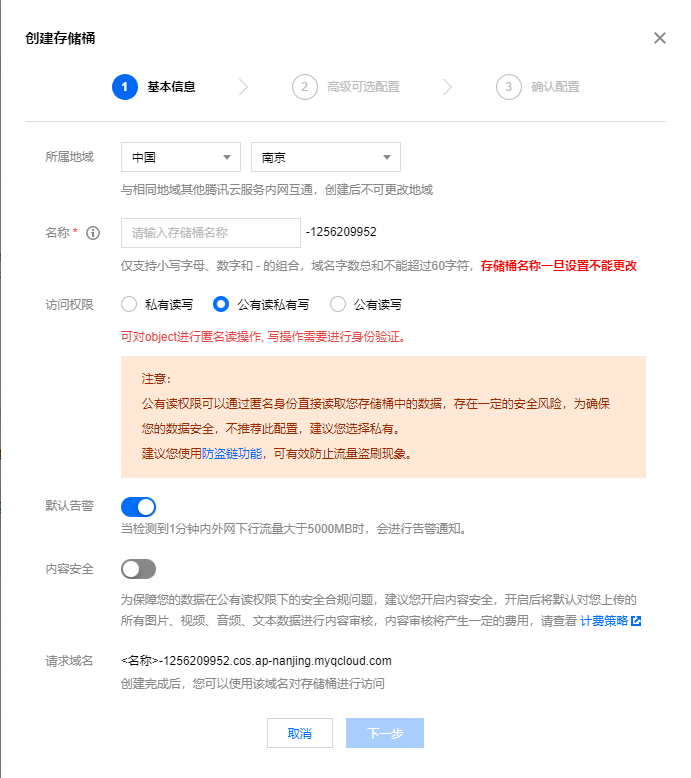

选择离自己相近的地域，根据自己的需求设置名称，**注意将访问权限设置为公有读私有写。**
设置完毕后点击下一步，高级配置保持默认，随后确认。

进入储存桶，开启**静态网站**，并配置。
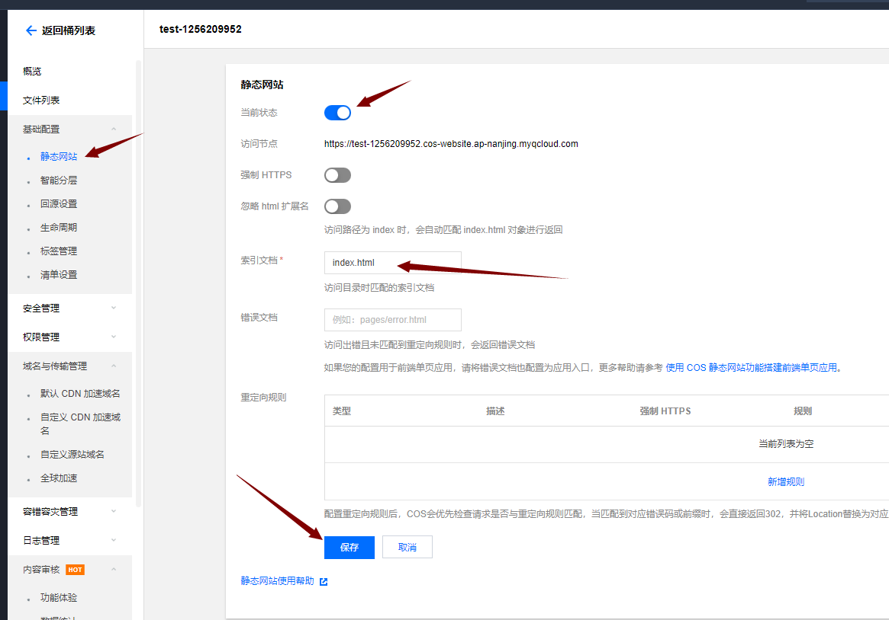
记录**访问节点**的链接，备用。
进入**文件列表**选择上传前端包。
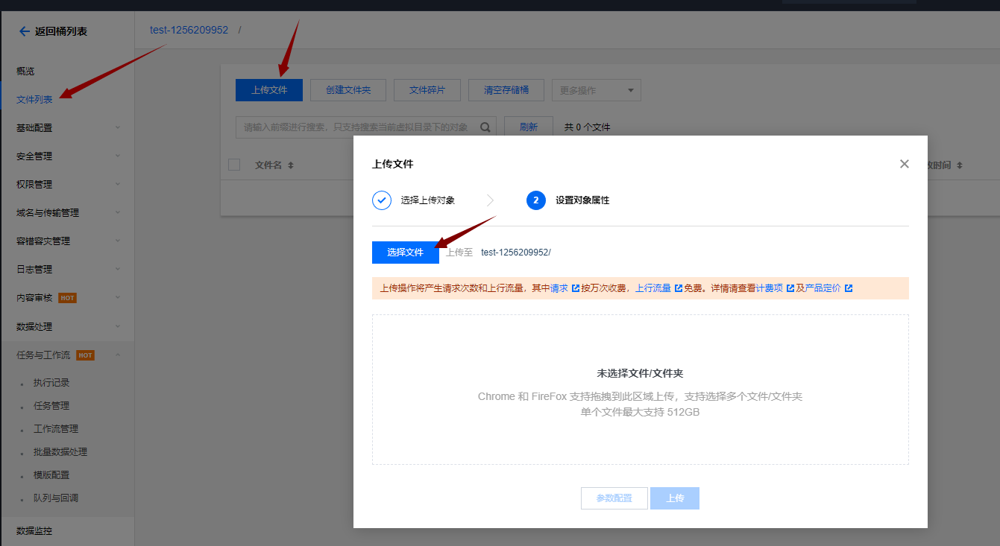
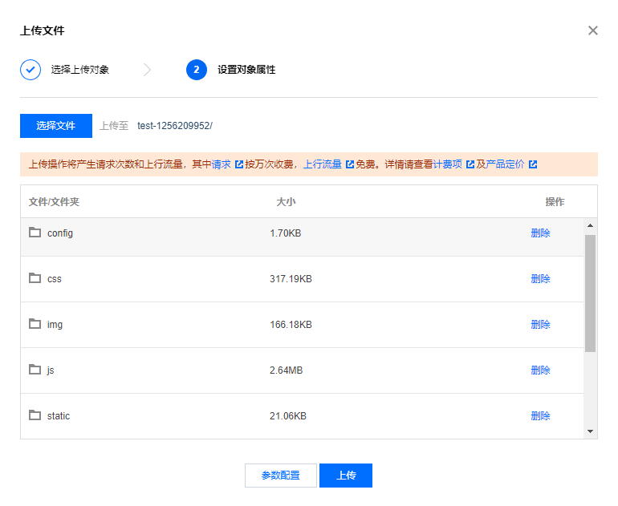
点击上传，测试上面记录的**访问节点**的链接是否可以访问。
[了解更多关于对象存储的知识](https://cloud.tencent.com/document/product/436/32670)
**自定义域名**
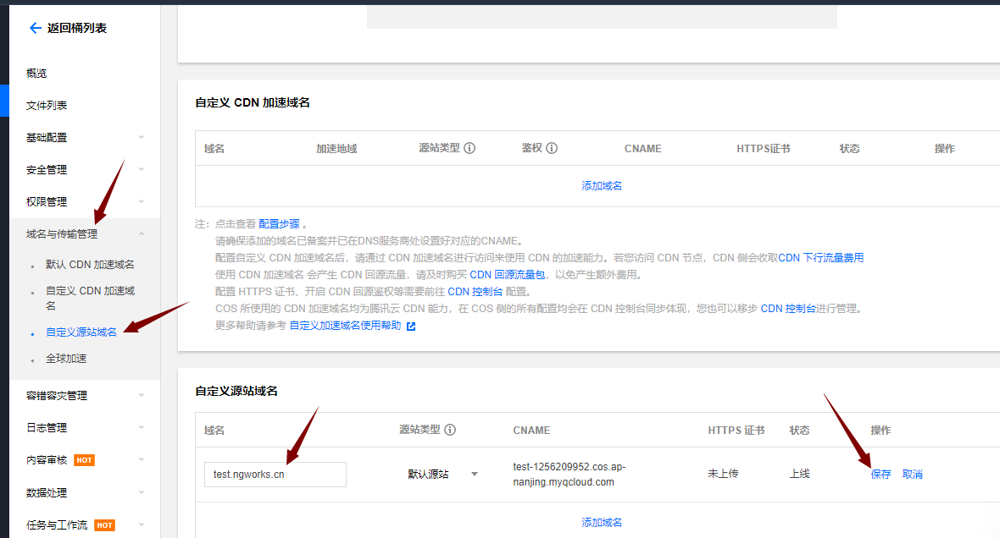
输入自己的域名，复制CNAME记录值。
**解析**
去到自己域名服务商的解析后台，设置自己主机记录，将记录类型选为CNAME，粘贴上面复制的CNAME记录值。
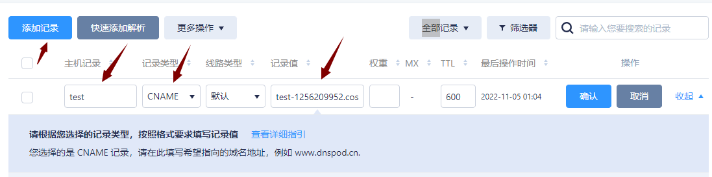
点击确定完成解析。

> 解析生效需要5-30分钟